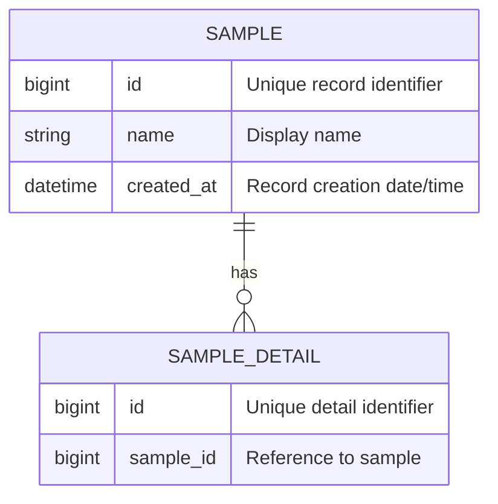

# 04 Database Schema + Data Dictionary + ER Diagram

## Entity Summary
| Entity | Purpose | Owner/Source |
|---|---|---|
|  |  |  |

## Table: table_name
| Field | Type | Nullable | Key | Default | Description |
|---|---|---|---|---|---|
| id | bigint | No | PK | auto | Unique record identifier |
| created_at | timestamp | No |  | current_timestamp | Record creation date/time |
| updated_at | timestamp | Yes |  |  | Last update date/time |

## Indexes
| Table | Index | Fields | Unique | Purpose |
|---|---|---|---|---|
|  |  |  | Yes/No |  |

## Relationships
| From Table | Field | To Table | Field | Relationship | Description |
|---|---|---|---|---|---|
|  |  |  |  | 1:N |  |

## ER Diagram

## Data Retention
- 

## Migration Notes
- 

