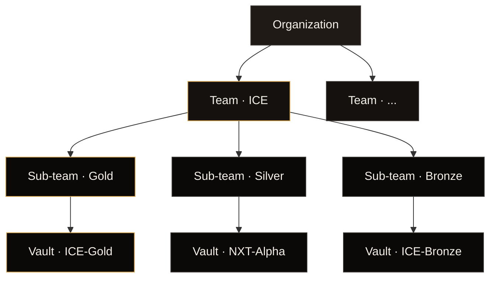
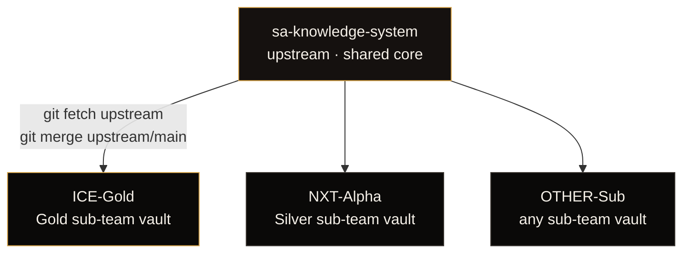
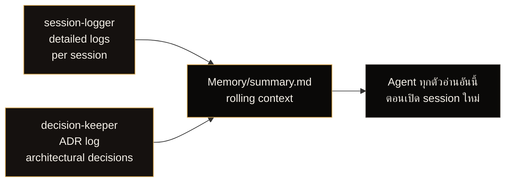
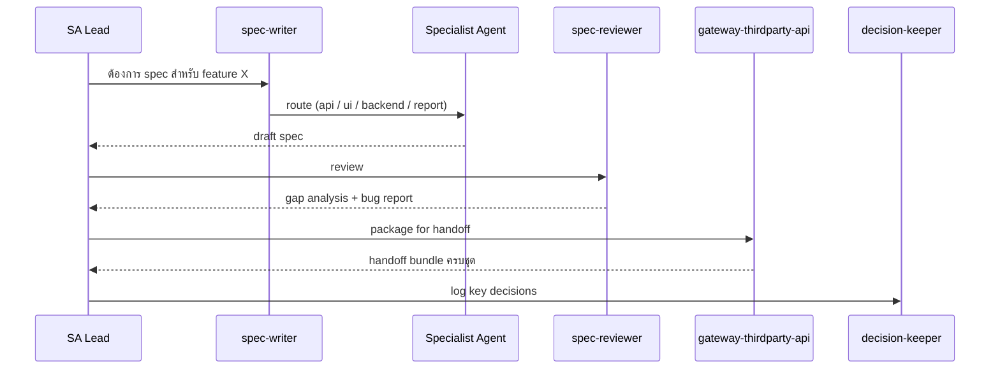
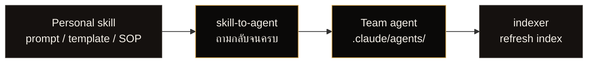

# Architecture

> ลำดับชั้น **องค์กร → ทีม → ทีมย่อย → vault** · ทีมย่อยแต่ละทีมมี Obsidian vault ของตัวเอง · ใช้ shared core ร่วมกัน แต่ลงมือแยกกัน

## ลำดับชั้นที่ถูกต้อง

**หลักการ:**

- **ICE** = ชื่อ team (ไม่ใช่ทั้งระบบ)
- **Gold** = ชื่อ sub-team หนึ่งใน ICE (ยังมี Silver, Bronze, …)
- **1 vault = 1 sub-team** เสมอ — ไม่รวมหลาย sub-team ใน vault เดียว เพราะ scope, ownership, และ memory ของแต่ละ sub-team ต่างกัน

## โมเดล 3 repo

**Shared core (upstream) เป็นเจ้าของ:**

- agent ทั้ง 15 ตัว (`.claude/agents/`)
- skill ทั้ง 13 ตัว (`.claude/skills/`)
- SOP ทั้งหมด (`Tech/SOP/`)
- Template note (`Templates/`)
- SA Skill source-of-truth (`ProgramType_Skills/`)
- เว็บไซต์นำเสนอ + เอกสารระบบ

**แต่ละ sub-team vault เป็นเจ้าของ:**

- Product ของ sub-team เอง (`Projects/<PRODUCT>/`)
- Memory ของ sub-team (`Memory/sessions/`, `Memory/summary.md`)
- ADR ของ sub-team (`Projects/_meta/architecture-decisions.md`)
- Reference data ของ sub-team (`reference_data/db_schema/`, `dev_wiki/`, `document_spec/`, `source_program/`)
- Agent เฉพาะ sub-team ที่ทำเพิ่มเอง (ผ่าน `skill-to-agent`)

เวลา shared core ดีขึ้น ทุก sub-team sync ด้วย merge เดียว — เวลา sub-team เขียน spec product ใหม่ มีแค่ vault ของ sub-team เองที่โต

## ทำไมต้องแยก vault ต่อ sub-team

| เหตุผล | รายละเอียด |
|---|---|
| Scope ต่างกัน | Gold ทำ product A · Silver ทำ product อื่น — ไม่มีประโยชน์ถ้าเห็น context ของกันและกัน |
| Memory ต่างกัน | session log + ADR ของ Gold ไม่ใช่ของ Silver — ปนกันจะทำให้ context สับสน |
| Ownership ชัด | GitHub permission ผูกกับ repo — sub-team owner ดูแล repo ของ sub-team |
| Sync แยก | ถ้า Gold ขยับเร็วกว่า Silver ไม่บล็อกกัน |
| Bloat ต่ำ | vault หนึ่งโตเป็นพันไฟล์ได้ — ไม่ควรเอาทุก sub-team ของ team ICE มากองรวม |

## โครงสร้าง vault ของ sub-team

<pre><code class="language-text">NXT-Alpha/
├── CLAUDE.md                    ← rules + convention
├── README.md                    ← onboarding ของ vault คุณเอง
├── .claude/
│   ├── agents/                  ← 15 agent (จาก shared core)
│   └── skills/                  ← 13 skill (จาก shared core)
├── .mcp.json                    ← Context7 MCP
├── .index/                      ← auto-generated โดย indexer agent
├── Memory/
│   ├── summary.md               ← rolling cross-session summary
│   └── sessions/YYYY-MM-DD.md   ← daily session log
├── Projects/
│   ├── _meta/
│   │   └── architecture-decisions.md  ← ADR log
│   └── &lt;PRODUCT&gt;/               ← real product spec
├── ProgramType_Skills/          ← SA skill source-of-truth (auto-synced from upstream)
├── reference_data/              ← team-owned reference data
│   ├── db_schema/
│   ├── dev_wiki/
│   ├── document_spec/
│   └── source_program/
├── Tech/SOP/                    ← SOP
├── Templates/                   ← note template
└── MOC/                         ← Map of Content</code></pre>

## 2 กลุ่มผู้ใช้ใน sub-team

ทีม SA ล้วน — ไม่มี Dev / QA

| Role | จำนวน | เครื่องมือ | สิทธิ์ |
|---|---|---|---|
| SA Lead | 1–3 / sub-team | Claude Code CLI + local clone | GitHub Write |
| SA Member | 10–30 / sub-team | Claude Code + Obsidian | GitHub Read (read-only) |

## Memory model

agent 2 ตัวทำงานเสริมกันเพื่อให้สมองของ sub-team ไม่หาย

## Spec workflow loop

## ขยายทีม agent ผ่าน skill-to-agent

ทุก SA มี skill ส่วนตัวอยู่แล้ว — prompt, template, checklist ที่ใช้ประจำ
นำเข้าระบบผ่าน `skill-to-agent`

## ทำไมมันเวิร์ค

- **Continuity** — SA คนใหม่อ่าน `Memory/summary.md` ก็ตามทันงาน
- **Consistency** — ทุก sub-team ใช้ agent set เดียวกัน SOP เดียวกัน
- **Speed** — orchestrator route, specialist execute, ไม่มี cost ของการสลับ context
- **Auditability** — ทุก note ที่ AI สร้างขึ้นมี `agent_used:` ใน frontmatter
- **Isolation** — แต่ละ sub-team ขยับเร็วได้โดยไม่กระทบ shared core หรือ sub-team อื่น
- **Extensibility** — สมาชิกแต่ละคนแปลง skill ส่วนตัวเป็น agent ของทีมได้ผ่าน `skill-to-agent`

## อยากดูข้างใน agent เป็นยังไง?

ดู [Agent Internals](agent-internals.md) — แสดงเนื้อหา `.md` จริงของ agent แบบเปิดให้เห็นทั้งหมด ตั้งแต่ frontmatter, system prompt, workflow, guardrails
