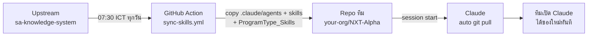

# Auto-sync (agents + skills)

> เพิ่ม agent หรือ skill ใหม่ใน template upstream แล้ว — ทีมที่ bootstrap ไปแล้วได้ของใหม่อัตโนมัติ โดยไม่กระทบเนื้อหา vault ของตัวเอง

## ภาพรวม

ทีมไม่ต้องสั่งอะไรเลย — เปิด Claude ก็ได้ของใหม่

## สิ่งที่ sync · สิ่งที่ไม่แตะ

| Path | sync จาก upstream? |
|---|---|
| `.claude/agents/` | ✓ ใช่ |
| `.claude/skills/` | ✓ ใช่ |
| `ProgramType_Skills/` | ✓ ใช่ (SA skills · UI, Backend, API, Report) |
| `Memory/`, `Projects/`, `reference_data/`, `Tech/`, `MOC/`, `Templates/`, `.obsidian/` | ✗ ของทีม ไม่แตะ |
| ไฟล์อื่นๆ (CLAUDE.md, README.md, .index/) | ✗ ของทีม ไม่แตะ |

## 3 ชั้นการ sync

### ชั้น 1 · GitHub Action (อัตโนมัติบน server)

ไฟล์: `.github/workflows/sync-skills.yml`

- **เวลาทำงาน:** ทุกวัน 07:30 ICT (cron `30 0 * * *` UTC) — ก่อนเริ่มงาน
- **กลไก:**
  1. Checkout repo ทีม
  2. `git fetch` จาก `ZaynTRPW/sa-knowledge-system`
  3. `git checkout upstream/main -- .claude/agents .claude/skills ProgramType_Skills`
  4. ถ้ามี diff → commit + push
- **สิทธิ์:** ใช้ `GITHUB_TOKEN` ในตัว ไม่ต้องตั้ง PAT
- **Manual trigger:** Actions tab → Run workflow

### ชั้น 2 · Claude SessionStart hook (อัตโนมัติบน local)

ไฟล์: `.claude/settings.json` + `scripts/session-start-pull.sh`

- **ทำเมื่อ:** เปิด Claude (startup), resume, หรือ /clear
- **กลไก:**
  - Throttle 6 ชม. (เก็บ state ใน `.index/last-pull`)
  - `git pull --ff-only origin <branch>`
  - ถ้า working tree dirty → ข้าม (กัน conflict)
  - ถ้า fail → log ใส่ `.index/last-pull.log` แล้วเงียบ ไม่ขัดงาน
- **ผลลัพธ์:** ถ้ามี agent/skill ใหม่ จะมีข้อความ `✓ pulled N new/updated agent(s)/skill(s)`

### ชั้น 3 · Manual sync (ทำเองได้ทุกเมื่อ)

ไฟล์: `scripts/sync-skills.sh` (macOS/Linux/Git Bash) + `scripts/sync-skills.ps1` (Windows)

**macOS / Linux / Git Bash:**

<pre><code>./scripts/sync-skills.sh</code></pre>

**Windows PowerShell:**

<pre><code>.\scripts\sync-skills.ps1</code></pre>

หลังจากนั้น:

- ดึง agents/skills จาก upstream เข้า working tree (ยังไม่ commit)
- รีวิวด้วย `git diff --staged .claude/`
- commit เมื่อพอใจ

## Edge cases

| สถานการณ์ | ผลลัพธ์ |
|---|---|
| Upstream เพิ่ม `.claude/agents/new-skill.md` | ✓ ได้ skill ใหม่ |
| ทีมแก้ไขไฟล์ใน `.claude/agents/` เอง | ⚠️ จะถูก overwrite ตอน sync — ให้ใส่ของ custom ใน `.claude/agents/custom/` แทน |
| ทีมเพิ่มไฟล์ใหม่ใน `.claude/agents/custom/` | ✓ ไม่หาย (sync ทับเฉพาะที่มาจาก upstream) |
| ทีมเพิ่มเนื้อหาใน `Memory/`, `Projects/`, `reference_data/` ฯลฯ | ✓ ไม่แตะเด็ดขาด |
| ทีมแก้ไฟล์ใน `ProgramType_Skills/` เอง | ⚠️ จะถูก overwrite ตอน sync — copy ไป `Projects/<PRODUCT>/` ก่อนแก้ |
| Network fail / merge conflict | ✓ Hook เงียบ log แล้วข้าม — Action retry วันถัดไป |

## ปิด auto-sync (ถ้าไม่ต้องการ)

**ปิด GitHub Action:**

<pre><code>git rm .github/workflows/sync-skills.yml
git commit -m "chore: disable auto-sync"
git push</code></pre>

**ปิด Claude SessionStart hook:**
ลบ `SessionStart` block ใน `.claude/settings.json` หรือลบไฟล์ทั้งไฟล์

ของในชั้นที่เหลือยังใช้ได้ (manual sync ทำมือเมื่อต้องการ)

## Troubleshooting

**Action ไม่รัน:**
- Actions tab → `Sync skills + agents from upstream` → Enable workflow
- Repo settings → Actions → General → Workflow permissions → Read and write

**Session hook ไม่ pull:**
- ดู `.index/last-pull.log`
- ลบ `.index/last-pull` เพื่อบังคับ pull ทันที (รีเซ็ต throttle)

**ทีม custom agent แล้วโดน overwrite:**
- ย้ายไป `.claude/agents/custom/<name>.md` — sync จะไม่แตะ subfolder ที่ไม่มีใน upstream
