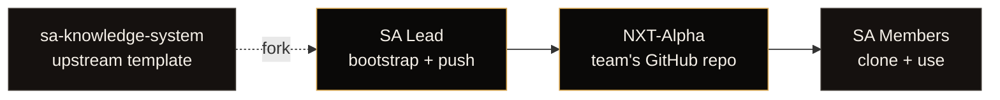
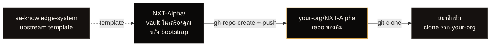

# Get Started

> ทีม SA ล้วน — เลือก role ของคุณ แล้วทำตามขั้นตอน · agent ทุกตัวใช้ได้ทั้ง Lead และ Member

---

## repo นี้คือ template — clone ไปใช้ได้เลย

`sa-knowledge-system` คือ **template repository** ที่ทุกอย่างพร้อมใช้ในตัวเดียว:

- agent 15 ตัว · skill 13 ตัว · Context7 MCP · Memory system · Obsidian config · SOPs
- มี `bootstrap.ps1` / `bootstrap.sh` **ที่จะ `git clone` template มาให้อัตโนมัติ** แล้ว rename, strip ส่วนเว็บออก, init git ใหม่, สร้าง folder product

คุณไม่ต้อง clone เอง — แค่รัน bootstrap script 1 บรรทัด มันจัดการให้ทุกอย่าง

ถ้าอยาก clone manual ก็ทำได้ — ดู [Manual setup](#manual-setup) ท้ายหน้า

---

For SA Lead

<h3 class="audience-card__title">ผมเป็นคนสร้าง vault ของทีม</h3>

ตั้งค่า vault ครั้งเดียว → push ขึ้น GitHub → สมาชิกทีม clone ไปอ่าน · เป็นเจ้าของ repo

<a class="audience-card__link" href="#path-a-sa-lead">เริ่ม path A →</a>

For SA Member

<h3 class="audience-card__title">SA Lead ของทีมสร้างไว้แล้ว ผมแค่จะใช้</h3>

Clone จาก GitHub → เปิดใน Obsidian → ถาม Claude ได้ทุก agent · แต่ไม่แก้ไฟล์ใน repo

<a class="audience-card__link" href="#path-b-sa-member">เริ่ม path B →</a>

---

## ภาพรวมทั้ง 2 path

---

## Prerequisites (ทั้ง 2 path)

| Tool | ทำอะไร | จำเป็น |
|---|---|---|
| Node.js 18+ | ใช้รัน Claude Code | ต้องมี |
| Git | ใช้ clone vault | ต้องมี |
| Claude account | Pro / Max หรือ API key | ต้องมี |
| Claude Code CLI | AI agent ใน terminal | bootstrap ลงให้ |
| Obsidian | ดู vault แบบ visual + graph view | ลงเอง |

ตรวจสอบ:

<pre><code class="language-bash">node --version
git --version</code></pre>

ถ้าขาด ลงก่อน: Node ที่ https://nodejs.org · Git ที่ https://git-scm.com/download/win · Obsidian ที่ https://obsidian.md/download

---

## ทำไมต้องใช้ Obsidian คู่กับ Claude Code

ทั้งสองทำหน้าที่ต่างกัน — ใช้คู่กันได้ผลดีที่สุด

| Claude Code | Obsidian |
|---|---|
| สั่งงาน agent ใน terminal | ดู / อ่าน vault แบบ visual |
| เขียน / แก้ไฟล์อัตโนมัติ | คลิก `[[wikilink]]` กระโดดไปมา |
| ถาม-ตอบเชิงค้นหา | เห็น graph ความสัมพันธ์ของ note ทั้งหมด |
| ผ่าน prompt + agent | เปิดดู PDF / spec ที่ import แล้ว |

สิ่งสำคัญที่ Obsidian ทำได้และ Claude Code ทำไม่ได้:

- **Graph view** — เห็นภาพรวมว่า note ไหนเชื่อมกับ note ไหน เป็น web ของ knowledge
- **Backlink panel** — เปิด note หนึ่ง เห็นทันทีว่ามี note ไหนอ้างถึงมัน
- **Canvas** — สร้าง mind map / architecture diagram แบบ visual
- **Reading view** — preview Markdown สวยๆ พร้อม callouts, embeds
- **Search** — full-text + tag filter + regex บน vault ทั้งหมด
- **Quick switcher** — Ctrl+O แล้วพิมพ์ชื่อ note → กระโดดทันที

หลัง `doc-to-vault` agent นำเข้า PDF / Word / Excel เก่าๆ ของทีมเข้ามาแล้ว — Obsidian คือเครื่องมือหลักในการเปิดดูทั้งหมดและเห็นว่าทุก doc โยงกันยังไง

---

## Path A · SA Lead

> คนที่ตั้ง vault ของทีม → push GitHub → invite สมาชิก

### Step A.1 · ติดตั้ง Claude Code

=== "Windows (PowerShell)"

<pre><code class="language-powershell">    npm install -g @anthropic-ai/claude-code</code></pre>

=== "macOS / Linux"

<pre><code class="language-bash">    npm install -g @anthropic-ai/claude-code</code></pre>

ตรวจสอบ + login ครั้งแรก:

<pre><code class="language-bash">claude --version
claude</code></pre>

### Step A.2 · รัน bootstrap (clone + setup ใน 1 คำสั่ง)

เปิด terminal ที่ folder ที่อยากให้ vault เกิด เช่น `~/work/` หรือ `D:\projects\`

=== "Windows (PowerShell)"

<pre><code class="language-powershell">    irm https://raw.githubusercontent.com/ZaynTRPW/sa-knowledge-system/main/bootstrap.ps1 | iex</code></pre>

=== "macOS / Linux"

<pre><code class="language-bash">    curl -fsSL https://raw.githubusercontent.com/ZaynTRPW/sa-knowledge-system/main/bootstrap.sh | bash</code></pre>

Script จะถาม 4 คำถาม:

<pre><code class="language-text">Team name (e.g. ICE):           NXT
Sub-team name (e.g. Gold):       Alpha
Owner name + email:              Somchai (somchai@company.com)
Products comma-separated:        ProductA,ProductB</code></pre>

แล้วจัดการให้ครบใน 1 ครั้ง:

1. **`git clone`** template `sa-knowledge-system` มาที่ folder ปัจจุบัน
2. **เปลี่ยนชื่อ folder** เป็น `<TEAM>-` (เช่น `NXT-Alpha`)
3. **ลบ presentation site** (`docs/`, `overrides/`, `mkdocs.yml`, `.github/`, bootstrap scripts) — sub-team ไม่ต้องแบกเว็บนำเสนอ
4. **สร้าง folder product** ตามที่กรอก (`Projects/ProductA/overview.md`, `Projects/ProductB/overview.md`)
5. **Seed** `Memory/summary.md` + ADR log
6. **Reset git history** + init ใหม่บน branch `main` → vault เป็นของทีมคุณจริงๆ

หลังเสร็จคุณจะมี folder ใหม่ชื่อ `NXT-Alpha/` พร้อมใช้งานทันที

### Step A.3 · เปิด vault ด้วย Obsidian

1. เปิด Obsidian
2. กด **Open folder as vault**
3. เลือก folder `NXT-Alpha`
4. Trust author
5. Settings → Files & Links → Detect all file extensions: ON
6. แนะนำเพิ่ม: เปิด Graph view (Ctrl+G) → ดูภาพรวม vault

โครงสร้างที่จะเห็น:

<pre><code class="language-text">NXT-Alpha/
├── CLAUDE.md
├── README.md
├── .obsidian/                   ← Obsidian config มาพร้อม template
├── .claude/
│   ├── agents/                  (15 agents)
│   └── skills/                  (13 skills)
├── .mcp.json
├── Memory/
│   ├── summary.md
│   └── sessions/
├── Projects/
│   ├── _meta/
│   │   └── architecture-decisions.md
│   ├── ProductA/
│   └── ProductB/
├── ProgramType_Skills/          (SA skills · auto-synced from upstream)
├── reference_data/
│   ├── db_schema/
│   ├── dev_wiki/
│   ├── document_spec/
│   └── source_program/
├── Tech/SOP/
├── Templates/
└── MOC/</code></pre>

### Step A.4 · ลองเรียก agent ครั้งแรก

<pre><code class="language-bash">cd NXT-Alpha
claude</code></pre>

ใน Claude Code:

<pre><code class="language-text">&gt; Use the session-logger agent: read at session start
&gt; Use the kb-assistant agent: vault นี้มี product อะไรบ้าง</code></pre>

ควรตอบ `ProductA, ProductB`

### Step A.5 · Import doc เก่าของทีมเข้า vault

vault ตอนนี้ยังว่าง — ก่อน push ขึ้น GitHub ให้ดึง doc เก่าเข้ามา

<pre><code class="language-text">&gt; Use the doc-to-vault agent:
  import ทั้ง folder ~/old-specs/ProductA/ เข้า vault</code></pre>

`doc-to-vault` agent จะ:

1. สแกน folder
2. ถามกลับเป็น batch (target folder, tags, MOC, draft status)
3. โชว์ preview ทุกไฟล์
4. รอ confirm → write
5. อัปเดต MOC + แนะนำให้รัน `indexer`

รองรับ PDF, DOCX, XLSX, PPTX, MD, TXT, HTML

หลัง import เสร็จ — เปิด Obsidian → Graph view → จะเห็น note ใหม่ทั้งหมดเชื่อมกันเป็น web · คลิกที่ note ไหนก็เห็น backlink ว่ามีอะไรอ้างถึงมันบ้าง

### Step A.6 · Push ขึ้น GitHub (สร้าง repo ของทีม)

ขั้นนี้สร้าง repo ใหม่ใน org/account ของทีม (เช่น `your-org/NXT-Alpha`) เพื่อเก็บ vault — สมาชิกในทีมจะ clone จาก repo นี้

ถ้ามี `gh` CLI:

<pre><code class="language-bash">cd NXT-Alpha

# สร้าง repo ใหม่ใน org/account ของทีม + push code ขึ้นไป
gh repo create &lt;your-org&gt;/NXT-Alpha --private --source=. --remote=origin --push

# (เลือกได้) ผูก upstream เพื่อดึง template updates ในอนาคต
git remote add upstream https://github.com/ZaynTRPW/sa-knowledge-system.git</code></pre>

ถ้าไม่มี `gh` CLI ให้สร้าง repo ผ่าน https://github.com/new ใส่ชื่อ `NXT-Alpha` (ใน org ของทีม) แล้วรัน:

<pre><code class="language-bash">git remote add origin https://github.com/&lt;your-org&gt;/NXT-Alpha.git
git push -u origin main
git remote add upstream https://github.com/ZaynTRPW/sa-knowledge-system.git</code></pre>

หลัง push เสร็จ — vault ของทีมจะอยู่ที่ `https://github.com/<your-org>/NXT-Alpha`

#### remote ที่มีหลัง push เสร็จ

<pre><code class="language-text">origin    https://github.com/&lt;your-org&gt;/NXT-Alpha.git           ← repo ของทีม
upstream  https://github.com/ZaynTRPW/sa-knowledge-system.git    ← template upstream</code></pre>

`origin` = repo ของทีม (push/pull ได้) · `upstream` = template (ดึง update เข้ามา)

### Step A.7 · Invite สมาชิกทีม

บน GitHub repo `your-org/NXT-Alpha`:

1. Settings → Collaborators → Add people
2. เพิ่ม SA Members ทีละคน
3. กำหนดสิทธิ์ **Read** (clone ได้ แต่ push ไม่ได้)

ส่งข้อมูลให้ทีม:

<pre><code class="language-text">Repo: https://github.com/&lt;your-org&gt;/NXT-Alpha       ← ของทีมคุณ
คู่มือ SA Member: ดู Path B ในหน้า Get Started</code></pre>

สมาชิกทีมจะ clone จาก URL นี้

### Step A.8 · Sync template updates ภายหลัง (เลือกได้)

ถ้าวันหนึ่ง template upstream อัปเดต agent / skill ใหม่ — ดึงเข้า repo ทีมได้:

<pre><code class="language-bash">git fetch upstream              # ดึงจาก template upstream
git merge upstream/main         # merge เข้า branch หลักของทีม
git push origin main            # push เข้า repo ของทีม</code></pre>

ปกติ conflict ไม่มี เพราะ template แตะแค่ `.claude/`, `Tech/SOP/`, `Templates/` — ส่วน `Projects/` ของทีมไม่ถูกแตะ

ขั้นนี้เป็น optional — ถ้าไม่ sync ก็ใช้งานได้ปกติ

---

## Path B · SA Member

> SA Lead push GitHub ให้แล้ว · คุณ clone มาใช้ได้ทุก agent · ไม่ต้อง commit / push อะไร

### Step B.1 · ติดตั้ง Claude Code

=== "Windows (PowerShell)"

<pre><code class="language-powershell">    npm install -g @anthropic-ai/claude-code</code></pre>

=== "macOS / Linux"

<pre><code class="language-bash">    npm install -g @anthropic-ai/claude-code</code></pre>

Login ครั้งแรก:

<pre><code class="language-bash">claude</code></pre>

### Step B.2 · ลง Obsidian

https://obsidian.md/download → install ปกติ (ฟรี ทุก OS)

### Step B.3 · Clone vault ของทีม

SA Lead ของทีมจะส่ง URL ของ repo ทีมให้ เช่น `https://github.com/your-org/NXT-Alpha`

<pre><code class="language-bash">git clone https://github.com/your-org/NXT-Alpha.git
cd NXT-Alpha</code></pre>

### Step B.4 · เปิดด้วย Obsidian

1. เปิด Obsidian
2. **Open folder as vault**
3. เลือก folder ที่ clone มา
4. Trust author
5. Settings → Files & Links → Detect all file extensions: ON
6. เปิด Graph view (Ctrl+G) → ดูภาพรวม note ทั้ง vault

สมาชิกทีมใช้ Obsidian เพื่อ:

- เปิดดู PDF / Word / Excel ที่ Lead นำเข้าผ่าน `doc-to-vault`
- คลิก wikilink เพื่อตามไปยัง spec ที่อ้างถึง
- ดู graph ว่า product / integration ของทีมเชื่อมกันยังไง
- search ทั้ง vault ผ่าน Ctrl+Shift+F

### Step B.5 · เรียก agent

<pre><code class="language-bash">cd NXT-Alpha
claude</code></pre>

ใน Claude Code — ใช้ agent ตัวไหนก็ได้ทั้ง 15 ตัว:

<pre><code class="language-text">&gt; Use the session-logger agent: read at session start
&gt; Use the kb-assistant agent: vault นี้มี product อะไรบ้าง
&gt; Use the spec-writer agent: ต้องการ spec API สำหรับ feature X
&gt; Use the doc-to-vault agent: import ~/my-notes/meeting.pdf</code></pre>

agent อาจสร้าง / แก้ไฟล์ในเครื่องคุณ — ใช้งานได้ปกติ แต่ **อย่า `git push`** เพราะ:

- คุณไม่มีสิทธิ์ push (repo เป็น read-only สำหรับคุณ)
- การเปลี่ยนแปลงในเครื่องจะหายตอน `git pull` ครั้งต่อไป
- ถ้าอยากให้ change เข้า repo จริง → DM SA Lead

### Step B.6 · Pull update เวลา SA Lead เพิ่มเนื้อหา

<pre><code class="language-bash">cd NXT-Alpha
git pull origin main</code></pre>

ถ้าเจอ conflict ตอน pull — สั่ง reset เพื่อทิ้ง local changes:

<pre><code class="language-bash">git reset --hard origin/main
git pull origin main</code></pre>

### Step B.7 · อยากเสนอแก้ไข

DM SA Lead พร้อมข้อมูล:

- ไฟล์ที่เกี่ยวข้อง
- คำอธิบายว่าอยากแก้/เพิ่มอะไร
- ถ้าเป็น agent ใหม่ — แชร์ prompt ส่วนตัว · Lead จะใช้ `skill-to-agent` แปลงให้

SA Lead เป็นคน commit + push เข้า repo ของทีม

---

## Cheat Sheet — agent ทุกตัวใช้ได้ทั้ง Lead และ Member

| อยากทำอะไร | คำสั่ง |
|---|---|
| เริ่ม session (refresh context) | `Use session-logger: read at session start` |
| ถามอะไรก็ได้เกี่ยวกับ vault | `Use kb-assistant: <คำถาม>` |
| เขียน spec ใหม่ | `Use spec-writer: <สิ่งที่ต้องการ>` |
| Import doc เก่า | `Use doc-to-vault: import <path>` |
| แปลง personal skill เป็น agent | `Use skill-to-agent: convert <path>` |
| Mockup UI | `Use spec-ui-designer: <ลักษณะหน้า>` |
| ออกแบบ API | `Use spec-api-designer: <ลักษณะ API>` |
| Java backend service spec | `Use spec-backend-service: <ลักษณะ service>` |
| Report TFS | `Use spec-report-designer: <ลักษณะ report>` |
| Test script | `Use spec-tester: <program> <scenario>` |
| Review code เทียบ spec | `Use spec-reviewer: <program>` |
| Dev handoff package | `Use gateway-thirdparty-api: <feature>` |
| Document DB schema | `Use db-schema-documenter: <dump.sql>` |
| Refresh index | `Use indexer: refresh` |
| Log decision | `Use decision-keeper: บันทึก decision — <ข้อความ>` |
| ปิด session | `Use session-logger: log this session` |

ความต่างเดียวระหว่าง Lead กับ Member คือ Lead push เข้า repo ได้ Member ไม่ได้ · agent ทุกตัวเรียกใช้ได้เหมือนกัน

---

## FAQ

ทำไม SA Member ห้าม push?

เพื่อความสม่ำเสมอของ vault — ถ้าทุกคน push ทับกันโดยไม่ผ่านการรีวิว vault จะมั่ว · SA Lead เป็นคน gate-keep การ commit เพื่อให้ note มีคุณภาพและตาม convention

แต่ผมเรียก agent ที่เขียนไฟล์ได้ใช่ไหม?

ได้ — agent สร้างไฟล์ในเครื่องคุณได้ตามปกติ แต่ไฟล์เหล่านั้นอยู่ในเครื่องเท่านั้น · ถ้าอยากให้เข้า repo ของทีม → ส่งให้ Lead

ต้องลงทั้ง Claude Code และ Obsidian ใช่ไหม?

ใช่ — Claude Code สำหรับสั่ง agent · Obsidian สำหรับดู vault, graph, และเปิด doc ที่ import เข้ามา

ทีมเรามี Confluence / Notion อยู่แล้ว ใช้แทนได้ไหม?

ใช้ได้ แต่ agent ออกแบบให้ทำงานบน file local — Confluence / Notion ไม่ได้ประโยชน์เต็มที่ · `doc-to-vault` ดึงข้อมูลจาก Confluence export มา vault ได้

บังคับใช้ GitHub ไหม?

ไม่บังคับ — local folder อย่างเดียวก็ได้ แต่จะไม่ได้ sync update, backup, collaborate

ทีมเล็ก 2-3 คน คุ้มไหม?

คุ้ม — Memory system ช่วยมากที่สุดเวลาคนน้อยแต่ context เยอะ

ของเก่าใน Confluence / Word ยกมาได้ไหม?

ได้ — ใช้ `doc-to-vault` agent (Step A.5) แปลงเข้า vault อัตโนมัติ · เห็นความสัมพันธ์ผ่าน Obsidian graph view

อยากเพิ่ม agent ของทีมเอง?

ใช้ `skill-to-agent` แปลง prompt ส่วนตัวเป็น agent · ถ้าคุณเป็น Lead ก็ commit เข้า repo · ถ้าเป็น Member ก็ส่งให้ Lead

---

## Manual setup (clone เอง · ทางเลือก) { #manual-setup }

ถ้าไม่อยากใช้ bootstrap script (เช่น offline, ไม่อยากให้ script รัน, อยากดูทุกขั้นเอง):

<pre><code class="language-bash">git clone https://github.com/ZaynTRPW/sa-knowledge-system.git NXT-Alpha
cd NXT-Alpha

# ลบ presentation site (ทีมไม่ต้องการเว็บนำเสนอใน vault)
rm -rf docs overrides mkdocs.yml requirements-docs.txt .github bootstrap.sh bootstrap.ps1

# สร้าง folder ที่จำเป็น (git ไม่ track folder ว่าง)
mkdir -p Memory/sessions Projects/_meta .index Projects/ProductA Projects/ProductB

# Seed initial files
echo "# Memory summary" &gt; Memory/summary.md
echo "# Architecture Decisions Log" &gt; Projects/_meta/architecture-decisions.md
echo "# ProductA" &gt; Projects/ProductA/overview.md
echo "# ProductB" &gt; Projects/ProductB/overview.md

# Reset git ให้เป็น vault ของทีมเอง
rm -rf .git
git init
git add -A
git commit -m "init: bootstrap NXT-Alpha from sa-knowledge-system"
git branch -M main

# ผูก upstream เพื่อ sync template updates ในอนาคต
git remote add upstream https://github.com/ZaynTRPW/sa-knowledge-system.git

# พร้อมใช้
claude</code></pre>

ผลลัพธ์เหมือนรัน bootstrap script ทุกประการ — เลือกใช้ตามถนัด

---

## ติดปัญหา

- Bootstrap script รันไม่ผ่าน → ตรวจ Node 18+ และ git
- `claude` command not found → restart terminal (PATH refresh)
- Agent ไม่ตอบ → ตรวจ `.claude/agents/<name>.md` มีไฟล์อยู่
- Obsidian เปิดแล้ว note ไม่ขึ้น → Ctrl+R refresh
- Pull ติด conflict (Path B) → `git reset --hard origin/main` แล้ว pull ใหม่
- อื่นๆ → DM SA Lead ของทีม shared core

ติดต่อทีม shared core ได้ที่:

Email

<a class="contact-card__value" href="mailto:Theerapong_Wea@freewillsolutions.com">Theerapong_Wea@freewillsolutions.com</a>

Microsoft Teams

<a class="contact-card__value" href="https://teams.microsoft.com/l/chat/0/0?users=Theerapong_Wea@freewillsolutions.com">Theerapong Weaha</a>

